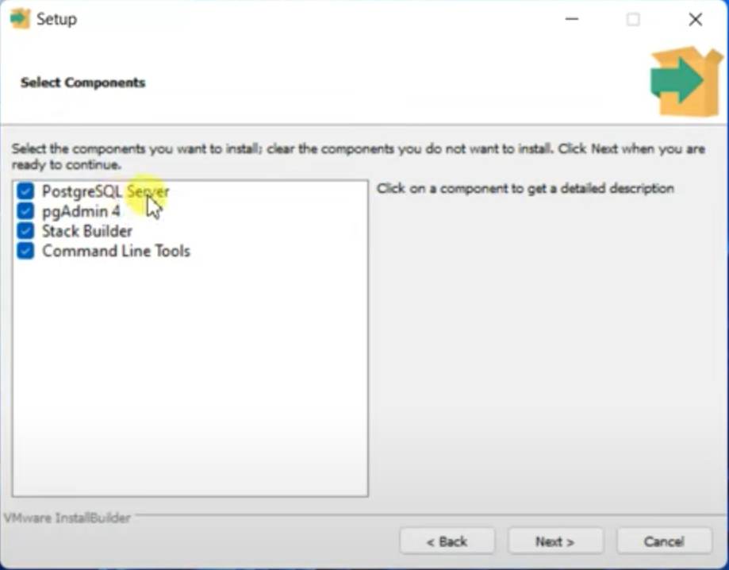
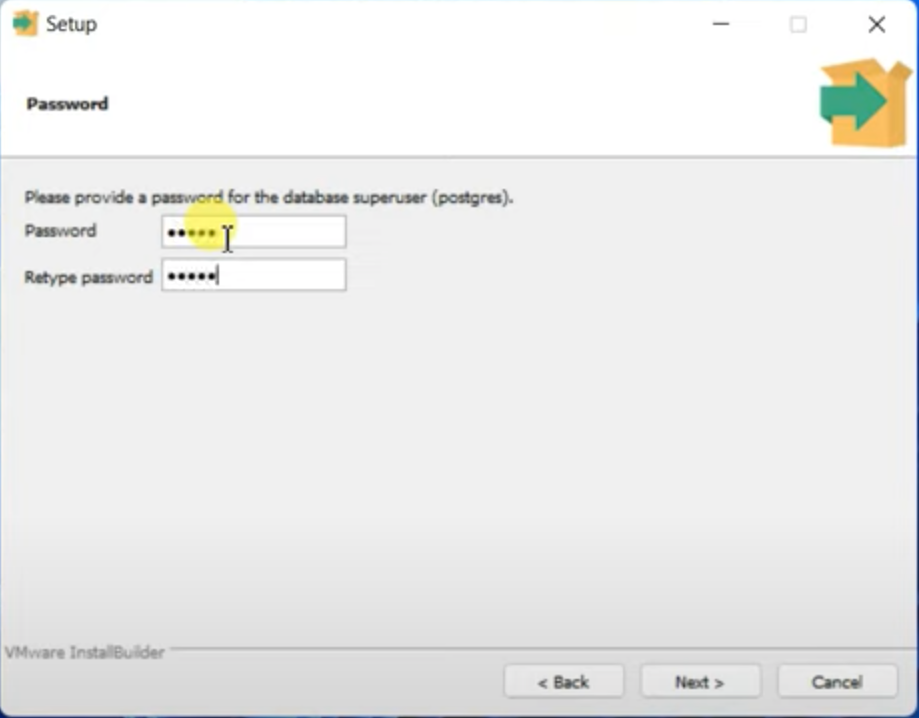
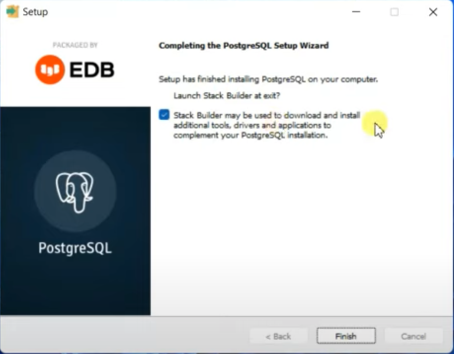
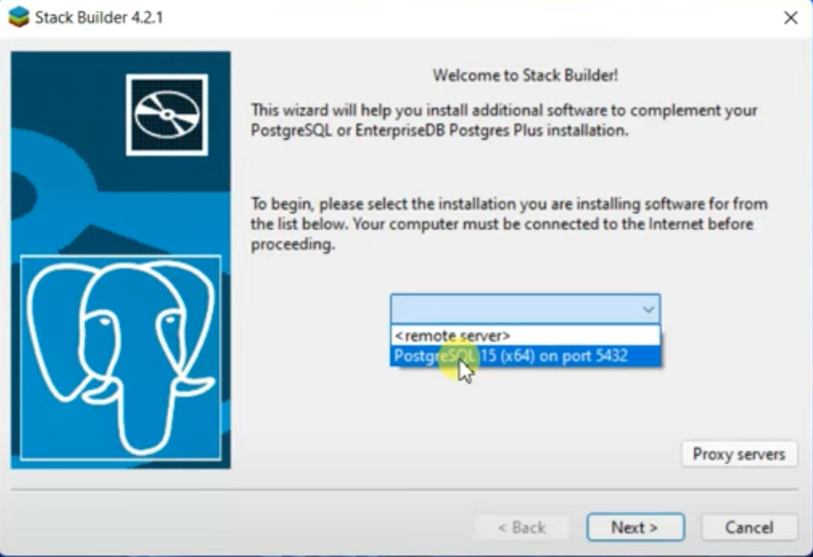
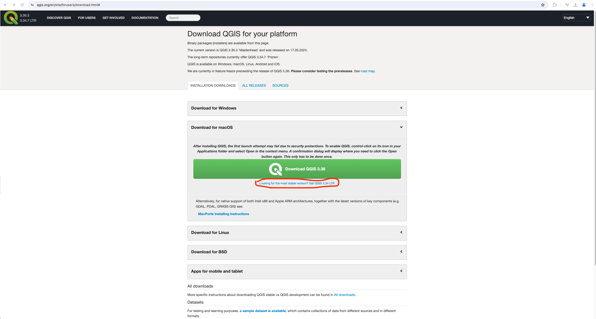
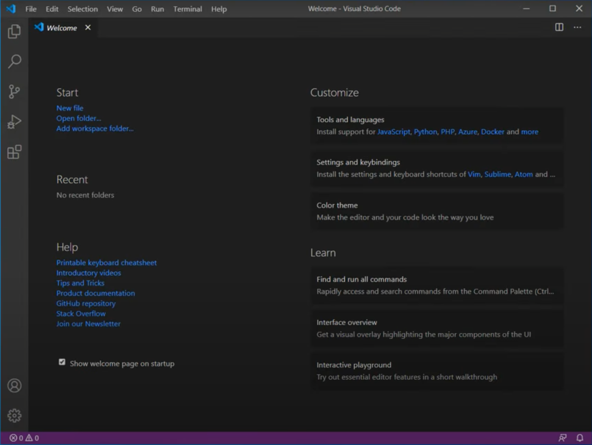

# Installation des outils du cours

## Installation de PostGreSQL

**Etape 1: Téléchargement et installation**

* Lien: [télécharger ici](https://www.enterprisedb.com/downloads/postgres-postgresql-downloads)
* Cliquer sur Installer:
  * Lors de l'installation, arrivé à cette étape: il faut installation toutes les 4 composantes proposés
  * 
  * Et à cette étape, il faut créer son nom d'utilisateur et son mot de passe;

    
  * Pour le serveur, selectionner Local
  * Après le telechargement, cocher la case StackBuilder et ensuite PostGreSQL pour installer StackBuilder

    

    

**Etape 2: Découverte**

* Dans votre barre de recherche windows, rechercher : **PgAdmin 4**
* Ensuite, rentrer les noms d'utilisateur et mot de passe
* Voilà nous êtes connectés

Félicitations, vous venez d'installer PostGreSQL et PostGIS !

Si vous avez du mal, vous pouvez voir cette vidéo: [install](https://www.youtube.com/watch?v=0n41UTkOBb0)

## Installation de QGIS

Nous allons installer la dernière version stable 3.34. Cette version présente l'absence de plusieurs et n'est pas en cours de maintenance contrairement à la dernière version 3.36. 

**Etape 1: Téléchargement et installation** 

* Lien: [télécharger ici](https://qgis.org/en/site/forusers/download.html#)

* Suivre toutes les étapes et cliquer sur Next

**Etape 2: Découverte**

* Dans votre barre de recherche, taper QGIS
* Lors du lancement s'affichera cette fenêtre

Félicitations, vous venez d'installer QGIS 3.34

Si vous avez du mal, vous pouvez voir cette vidéo: [install](https://www.youtube.com/watch?v=rSP7a2b_e-g)

## Installation de VSCode

**Etape 1: Téléchargement et installation** 

* Lien: [télécharger ici](https://code.visualstudio.com/download)
* Cliquer sur le téléchargement puis commencer l'installation en cliquant sur install
* Suivre toutes les étapes, vous pouvez changer la localisation du fichier
* Ajouter une icone de VSCode à votre bureau en cochant la case
* Cliquer sur Next et finaliser votre inscription

**Etape 2: Découverte** 

* Après l'installation, cliquer sur l'icone sur votre bureau
* Vous avez accès VSCode à présent

Félicitations, vous venez d'installer VSCode

Si vous avez du mal, vous pouvez voir cette vidéo: [install](https://www.youtube.com/watch?v=-UEbHGufGTk)
