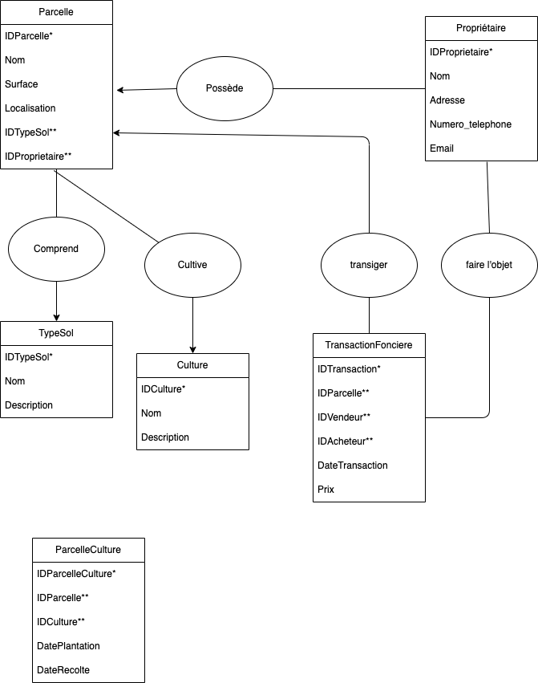
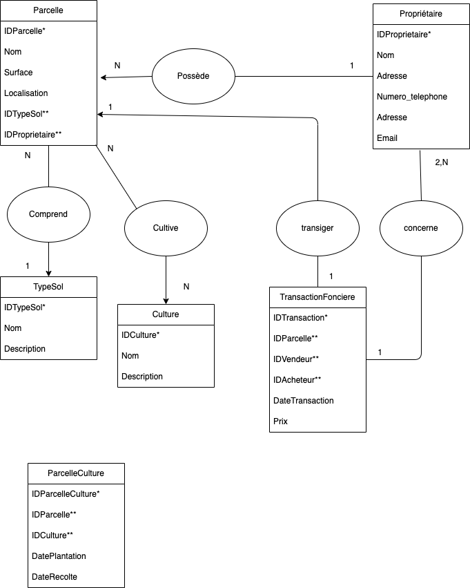
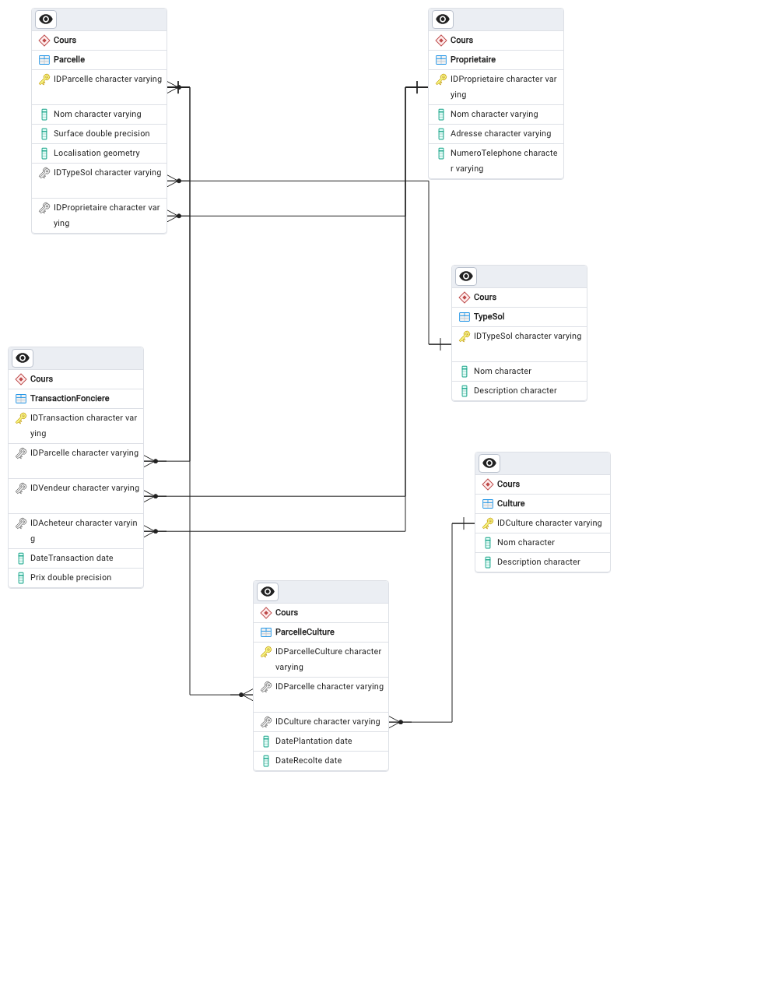

# Chapitre 1: Introduction générales aux bases de données

## Définition de la notion de donnée et de base de donnée 

* **Une donnée:**
* **Une base de donnée:**
* Un SGBD
  * Le côté serveur
  * Le côté client

## Utilité des bases de données

### * Différence entre base de donnée et stockage de la donnée

### * Principe des bases de données

Les bases de données sont basées sur deuux principes 

### * Normalisation

La normalisation est un concept très crucial dans la conception des bases de données 

## Le formalisme dans les bases de données

Pour illustrer cette partie, nous nous mettrons dans un contexte de gestion du foncier. 

* Un propriétaire peut posséder plusieurs parcelles, une parcelle appartient à un seul propriétaire
* Une parcelle a un seul type de sol, un type de sol peut être associé à plusieurs parcelles
* Une parcelle peut cultiver plusieurs cultures, une culture peut être cultivée sur plusieurs parcelles
* Une transaction foncière concerne une seule parcelle
* Une transaction foncière a un vendeur et un acheteur, qui sont des propriétaires

### Modèle Conceptuel de Données (MCD) 

Le Modèle conceptuel de donnée est une conception du schéma de la base de donnée. Il est composé de deux éléments: 

* Entité: ce sont les entrées de la base de donnée
* Association: ce sont les liaisons entres les entités de la base de données

### Logique Logique

Comme son nom l'indique, il s'agit du modèle de liaison entre éléments de la base de donnée. Le plus étant le modèle relationnel. 

Le modèle relationnel est un modèle où une entité d'une base de donnée est référencée dans une autre entité par une **clé étrangère**. 

### Modèle Physique 

C'est le niveau naturel qui vient après l'élaboration de la logique relationnelle. Il s'agit concrètement de l'implementation de la base de donnée sous un SGBD. 

### Exemples

Prenons le cas d'une bibliothèque: 

Les entités pour cette base de donnée sont: 

* Livres
* Auteurs
* Membres
* Emprunt

Un livre a plusieurs attributs comme (num_livre, titre, genre, annee_pub, num_auteur). Un auteur a les attributs ( num_auteur, nom, date_naissance, nationalité) , un membre a pour attributs (num_membre, nom, address, num_telephone, email, date_inscription) et emprunt( num_emprunt, num_livre, num_membre, date_emprunt, date_retour_prevue, date_retour_effective) 

1. Déterminer les clés primaires et éventuellement les clés étrangères
2. Établir les modèles conceptuelles de donnés
3. Établir le modèle physique sous PgAdmin
