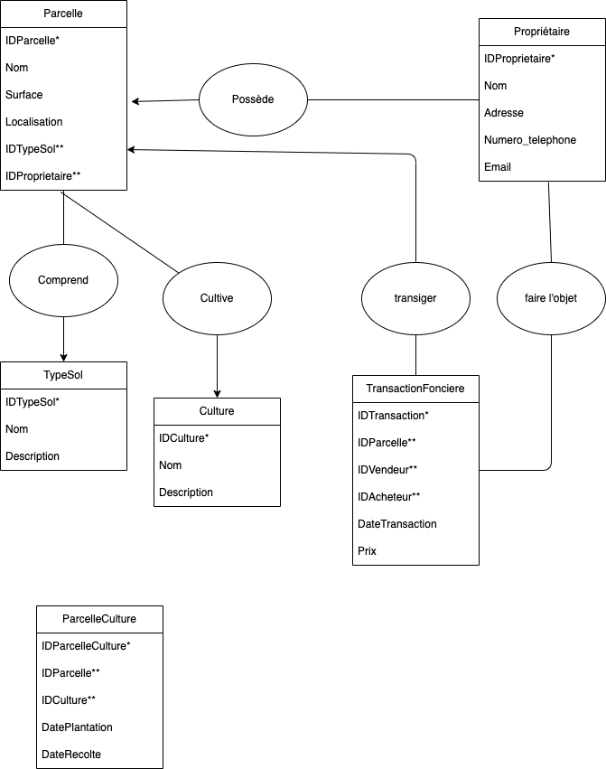
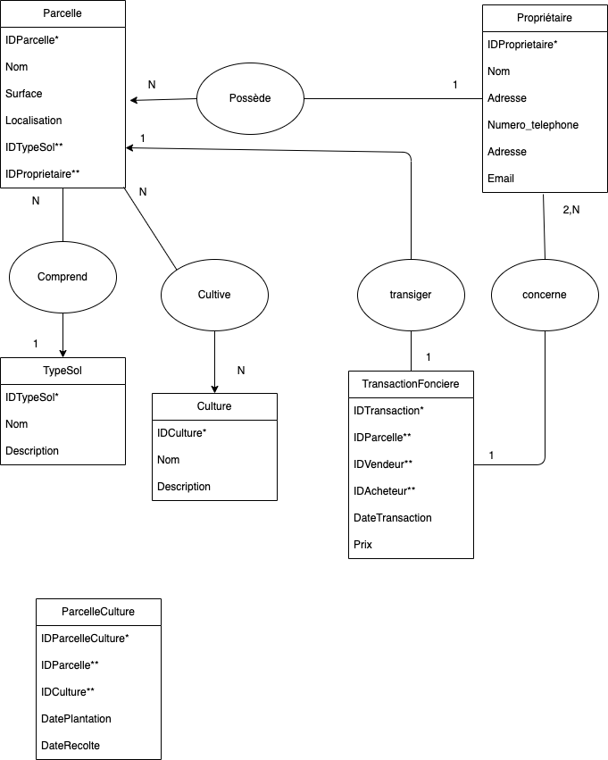
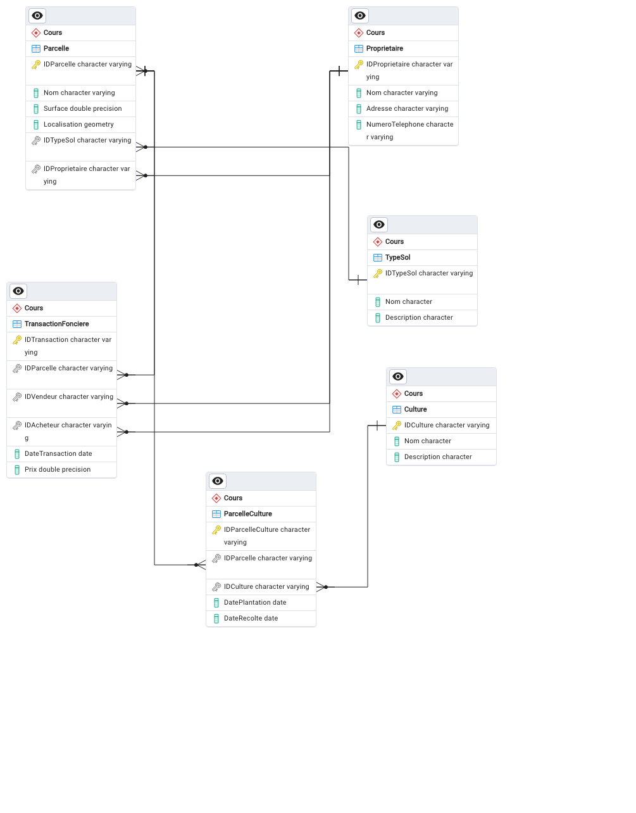

# Chapitre 1: Introduction générales aux bases de données

## Définition de la notion de donnée et de base de donnée

* **Une donnée**:  représentation d'une chose du monde ou *représentation d'une information stockée sous forme numérique ou sous forme papier*
* **Une base de donnée**: Dans le language courant, il s'agit d'un ensemble de donnée structurée. Dans le formalisme informatique et selon l'entreprise Oracle: *Une base de données est un ensemble d'informations qui est organisé de manière à être facilement accessible, géré et mis à jour*
* **Un SGBD** : **Un système de gestion de** **base de donnée** (SGBD) est le logiciel qui permet à un ordinateur de stocker, récupérer, ajouter, supprimer et modifier des données. Le SGBD gère trois choses importantes : les données, le moteur de base de données qui permet d'accéder aux données, de les verrouiller et de les modifier, et le schéma de base de données, qui définit la structure logique de la base de données
* **Différence entre PostGreSQL et PgAdmin**:
  * PostGreSQL: Système de gestion des bases de données relationnelles qui est utilisé pour stocker et gérer la donnée
  * PgAdmin: Un système graphique pour faciliter l'interrogation de PostGreSQL

## Utilité des bases de données

### * Différence entre base de donnée et stockage de la donnée

### * Principe des bases de données

Les bases de données sont basées sur trois principes:

* **Le principe d’Atomicité** garantit la bonne exécution de la transaction. Les transactions de base de données, comme les atomes, peuvent être décomposées en plus petites parties. Si une partie d'une transaction échoue, toute la transaction sera annulée.
* **La propriété de Cohérence** signifie que seules les données qui suivent des règles prédéfinies peuvent être écrites dans la base de données
* **L’isolement** fait référence à la capacité de traiter simultanément plusieurs transactions de manière indépendante
* **La durabilité** requiert de rendre les défaillances invisibles pour l'utilisateur final. Les données sont sauvegardées une fois la transaction terminée, même en cas de panne de courant ou de défaillance du système

### * Normalisation

*Les formes normales ont pour objectif de maintenir la qualité d’une structure de tableau en considérant les contraintes relationnelles : puissance du langage de requêtes, gestion de la redondance.*

## Le formalisme dans les bases de données

Pour illustrer cette partie, nous nous mettrons dans un contexte de gestion du foncier.

* Un propriétaire peut posséder plusieurs parcelles, une parcelle appartient à un seul propriétaire
* Une parcelle a un seul type de sol, un type de sol peut être associé à plusieurs parcelles
* Une parcelle peut cultiver plusieurs cultures, une culture peut être cultivée sur plusieurs parcelles
* Une transaction foncière concerne une seule parcelle
* Une transaction foncière a un vendeur et un acheteur, qui sont des propriétaires

### Modèle Conceptuel de Données (MCD)

Le Modèle conceptuel de donnée est une conception du schéma de la base de donnée. Il est composé de deux éléments:

* Entité: ce sont les entrées de la base de donnée
* Association: ce sont les liaisons entres les entités de la base de données

### Logique Logique

Comme son nom l'indique, il s'agit du modèle de liaison entre éléments de la base de donnée. Le plus étant le modèle relationnel.

Le modèle relationnel est un modèle où une entité d'une base de donnée est référencée dans une autre entité par une **clé étrangère**.

### Modèle Physique

C'est le niveau naturel qui vient après l'élaboration de la logique relationnelle. Il s'agit concrètement de l'implementation de la base de donnée sous un SGBD.

### Exemples

Prenons le cas d'une bibliothèque:

Les entités pour cette base de donnée sont:

* Livres
* Auteurs
* Membres
* Emprunt

Un livre a plusieurs attributs comme (num_livre, titre, genre, annee_pub, num_auteur). Un auteur a les attributs ( num_auteur, nom, date_naissance, nationalité) , un membre a pour attributs (num_membre, nom, address, num_telephone, email, date_inscription) et emprunt( num_emprunt, num_livre, num_membre, date_emprunt, date_retour_prevue, date_retour_effective)

1. Déterminer les clés primaires et éventuellement les clés étrangères
2. Établir les modèles conceptuelles de donnés
3. Établir le modèle physique sous PgAdmin
