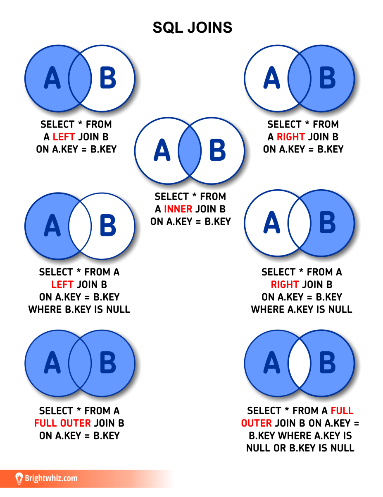

# Chapitre 2: Le Language SQL

## SQL Data Type

### Data Type

| Import    | Stocké          | Rôles                                                     |
| --------- | ---------------- | ---------------------------------------------------------- |
| String    | VARCHAR()        | enregistrement des caractères                             |
| Date/Time | TIMESTAMP        | enregistrement des dates comme année, mois ...., temps... |
| Number    | DOUBLE PRECISION | Pour les valeurs numériques                               |
| Boolean   | BOOLEAN          | Deux valeurs TRUE ou FALSE                                 |

### Change Data Type

* CAST

  ```sql
  CAST(nom_colonne AS integer)
  ```
* Syntaxe ( :: )

  ```sql
  nom_colonne::integer
  ```

## Requêtes SQL

Dans cette partie, nous traiterons de quelques requêtes, mais vous pourrez avoir une liste plus developpée [ici](https://sql.sh) 

### Requête de création

* CREATE

```sql
-- Creation de base de donnée
CREATE DATABASE entreprise ;

-- Creation de table 
CREATE TABLE Customer(
    CustomerID INT PRIMARY KEY,
    CustomerName VARCHAR(50),
    LastName VARCHAR(50),
    Country VARCHAR(50),
    Age INT CHECK (Age >= 0 AND Age <= 99),
    Phone int(10)
);
```

### Insertion et Import de données

* INSERT INTO
  ```sql
  INSERT INTO table_name (column1, column2, …) VALUES (value1, value2, …);

  INSERT INTO Customer (CustomerID, CustomerName, LastName, Country, Age, Phone)
  VALUES (1, 'Shubham', 'Thakur', 'India','23','xxxxxxxxxx'),
         (2, 'Aman ', 'Chopra', 'Australia','21','xxxxxxxxxx'),
         (3, 'Naveen', 'Tulasi', 'Sri lanka','24','xxxxxxxxxx'),
         (4, 'Aditya', 'Arpan', 'Austria','21','xxxxxxxxxx'),
         (5, 'Nishant. Salchichas S.A.', 'Jain', 'Spain','22','xxxxxxxxxx');
  ```
* COPY FROM
  ```sql
  COPY table_name FROM 'file path' DELIMITER "," CSV HEADER;
  ```

### Modification et Suppression

* ALTER TABLE

  ```sql
  -- ajouter une colonne 
  ALTER TABLE nom_table
  ADD nom_colonne type_donnees

  ALTER TABLE Customer
  ADD Salaire DOUBLE;

  -- changer le type de données
  ALTER TABLE nom_table
  ALTER COLUMN nom_colonne TYPE type_donnees

  ALTER TABLE Customer
  ALTER COLUMN LastName TYPE VARCHAR(25);

  -- Renommer une colonne 
  ALTER TABLE Customer RENAME CustomerName TO CustomerNom;

  ```
* DELETE

  ```sql
  -- suppression par condition
  DELETE FROM nom_table
  WHERE condition; 

  -- tout supprimer
  DELETE FROM nom_table; 
  TRUNCATE TABLE nom_table; -
  ```

  Ici TRUNCATE réinitialise l'auto-incrementation contrairement à Delete
* DROP

  ```sql
  DROP TABLE nom_table;
  ```
* UPDATE

  ```sql
  UPDATE table
  SET colonne_1 = 'valeur 1', colonne_2 = 'valeur 2', colonne_3 = 'valeur 3'
  WHERE condition;
  ```

### Export de données

* COPY TO

```sql
COPY table_name TO 'file path' DELIMITER "," CSV HEADER;
```

```

```

## Fonctions SQL et Jointures Syntaxiques

### Clause SELECT et WHERE

* SELECT : permet de selectionner et afficher des attributs

```sql
SELECT col1, col2,..., coln 
	FROM table; 
```

SELECT DISTINCT : permet des valeurs de l'attribut

WHERE

```sql
SELECT col1, col2,..., coln 
	FROM table
	WHERE condition1
```

AND

```sql
SELECT col1, col2,..., coln 
	FROM table
	WHERE condition1 AND condition2
```

OR

```sql
SELECT col1, col2,..., coln 
	FROM table
	WHERE condition1 OR condition2
```

IN

```sql
SELECT col
	FROM table
	WHERE col IN (val1, val2, ...,valN)
```

BETWEEN

```sql
SELECT col
	FROM table
	WHERE col BETWEEN val1 AND val2
```

LIKE

```sql
SELECT col1, col2,..., coln 
	FROM table
	WHERE col LIKE 'modele' ; 


-- caractère se terminant par modele
SELECT col1, col2,..., coln 
	FROM table
	WHERE col LIKE '%modele' ; 

-- caractère commençant par modele
SELECT col1, col2,..., coln 
	FROM table
	WHERE col LIKE 'modele%' ;

-- caractère qui comprend modele
SELECT col1, col2,..., coln 
	FROM table
	WHERE col LIKE '%modele%' ;

-- caractère commençant par 'mo' et se terminant par 'le'
SELECT col1, col2,..., coln 
	FROM table
	WHERE col LIKE 'mo%le' ;

-- caractère quelconque entre 'm' et 'd'. Exemple: mad, mzd
SELECT col1, col2,..., coln 
	FROM table
	WHERE col LIKE 'm_d' ;
```

ILIKE: permet de selectionner independamment de la CASE

### Fonctions d'aggregation

Ces fonctions permettent des fonctions statistiques qui permettent d'appliquer une fonction sur plusieurs au même moment.

* COUNT() , AVG(), MAX(), MIN(), SUM()

  ```sql
  SELECT fonction(nom_colonne) FROM nom_table; 

  -- Exemple: 
  SELECT COUNT(*) FROM table; 
  ```
* GROUP BY: c'est la fonction filtre et s'utilise avec les fonctions d'aggregation. **Attention**: L'attribut dans le GROUP BY doivent être dans la clause SELECT

  ```sql
  SELECT client, SUM(client)
  	FROM achat 
  	GROUP BY client; 
  ```
* ORDER BY: comme dans Excel, elle permet de trier le resultat

  ```sql
  SELECT client, SUM(client)
  	FROM achat 
  	GROUP BY client
  	ORDER BY client ASC ; 
  ```
* HAVING : Il s'agit de la même clause que WHERE mais à la différence qu'elle s'applique aux fonctions d'aggregat

  ```sql
  SELECT client, SUM(client)
  	FROM achat 
  	GROUP BY client
  	ORDER BY client
  	HAVING COUNT(client) > 10 ; 
  ```

### Contraintes

* Clé Primaire : C'est un attribut ou un ensemble d’attributs minimal identifiant de manière unique. Une clef candidate est un attribut ou un ensemble d’attributs minimal identifiant de manière unique chaque tuple d’une relation.

  ```sql

  ```
* Clé étrangère : c'est une clé primaire dans la table parent
* CASCADE
* ```sql
  CREATE TABLE Authors (
      AuthorID INT PRIMARY KEY,
      AuthorName VARCHAR(200)
  );

  CREATE TABLE Books (
      BookID INT PRIMARY KEY,
      Title VARCHAR(255),
      AuthorID INT,
      FOREIGN KEY (AuthorID) REFERENCES Authors(AuthorID) ON DELETE CASCADE
  );


  INSERT INTO Authors (AuthorID, AuthorName) VALUES (1, 'John Doe');
  INSERT INTO Authors (AuthorID, AuthorName) VALUES (2, 'Minal Pandey');
  INSERT INTO Authors (AuthorID, AuthorName) VALUES (3, 'Mahi Pandey');

  INSERT INTO Books (BookID, Title, AuthorID) VALUES (101, 'Introduction to SQL', 1);
  INSERT INTO Books (BookID, Title, AuthorID) VALUES (102, 'Database Fundamentals', 2);
  INSERT INTO Books (BookID, Title, AuthorID) VALUES (103, 'Advanced SQL', 2);
  INSERT INTO Books (BookID, Title, AuthorID) VALUES (104, 'Web Development', 3);
  ```

  * ON DELETE : quand la clé primaire dans la table parent est supprimé alors la clé étrangère dans la table fille est automatiquement mis à jour

    ```sql
    DELETE FROM Authors WHERE AuthorID = 2;
    ```
  * ON UPDATE : quand la clé primaire dans la table parent est mis à jour alors la clé étrangère dans la table fille est automatiquement mis à jour

    ```sql
    UPDATE Authors SET AuthorID = 1 WHERE AuthorID = 2;
    ```
  * ON INSERT : On peut ajouter un nouvel élement dans la table référencé quand il est ajouté à la table mère
* ```sql
  INSERT INTO Authors (AuthorID, AuthorName) VALUES (4, 'Sukumar Reddy');
  INSERT INTO Books (BookID, Title, AuthorID) VALUES (105, 'Data Science', 4);
  ```

### Jointures syntaxiques




### Divers requêtes 

* CASE : c'est la clause "Si/Sinon"

```sql
CASE a 
       WHEN 1 THEN 'un'
       WHEN 2 THEN 'deux'
       WHEN 3 THEN 'trois'
       ELSE 'autre'
END


-- Exemple 
SELECT id, nom, marge_pourcentage, prix_unitaire, quantite, 
    CASE 
      WHEN marge_pourcentage=1 THEN 'Prix ordinaire'
      WHEN marge_pourcentage>1 THEN 'Prix supérieur à la normale'
      ELSE 'Prix inférieur à la normale'
    END
FROM `achat`
```


* LIMIT et OFFSET
  * LIMIT : c'est le nombre de resultat à retourner
  * OFFSET : c'est le decalage

```sql
SELECT *
FROM table
LIMIT 10 OFFSET 5
```

## Requêtes Avancées

### Sous-Requêtes

```sql
SELECT table.champ1, table.champ2  
	FROM (
		SELECT champ1, champ2, ...
			FROM table 
		)
```

### Requête WITH

```sql
WITH table_temporaire AS (
	SELECT champ1, champ2, ...
		FROM table ) , 
	SELECT table.champ1, table.champ2, ....
		FROM table, table_temporaire
```

```sql
UPDATE table1
SET colonne_1 = 'valeur 1', colonne_2 = 'valeur 2', colonne_3 = 'valeur 3'
WHERE condition1;
```
